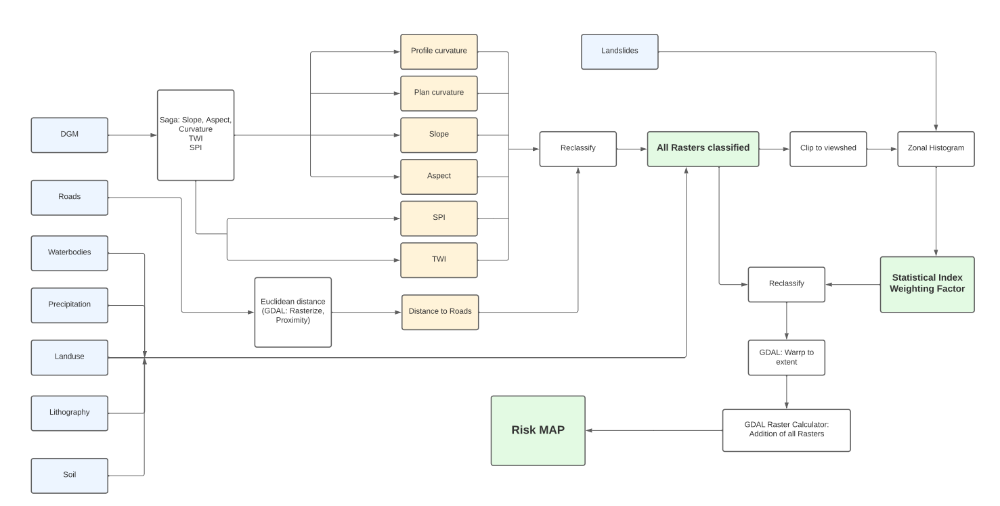
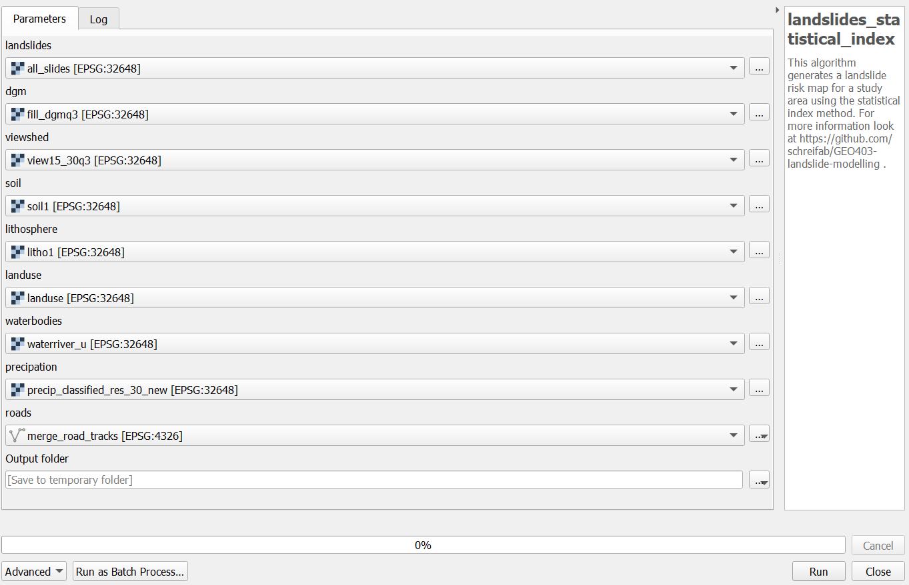
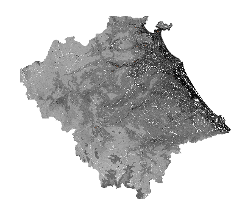

# GEO403-landslide-modelling
This GitHub-Repository contains QGIS-proccessing scripts for the calculation of landslide risk in a study area. 
Therefore, the statistical index method and the weighting factor method can be used. 
The functionality can be found in the flow chart below. 

## Requirements
The scripts can be executed via QGIS processing toolbox -> open existing script -> execute.
An Interface wil open.
Before running, the appropriate layers must be selected. 
IMPORTANT: Make sure that SAGA and GDAL are correctly installed in Your QGIS Version. Especially when using SAGA, problems can currently occur.
If so, uninstall and delete of all GQIS components and reinstall the latest QGIS version should solve the Problem. QGIS 3 is reqiured.

## Data 
Test data for a study area in Vietnam are given.
The data can be downloaded via http://leutra.geogr.uni-jena.de. The following Input Rasters are required:
dem: http://leutra.geogr.uni-jena.de/vgtbRBIS/metadata/view.php?view=geodata&id=887
lithosphere: http://leutra.geogr.uni-jena.de/vgtbRBIS/metadata/view.php?
soil: http://leutra.geogr.uni-jena.de/vgtbRBIS/metadata/view.php?
waterbodies: http://leutra.geogr.uni-jena.de/vgtbRBIS/metadata/view.php?view=geodata&id=1474
landslides: http://leutra.geogr.uni-jena.de/vgtbRBIS/metadata/view.php?view=geodata&id=1484&ident=704463531728833920
landuse, roads,viewshed and
precipation: via Google Drive in data.txt

For further information on the study area and methodology, it is recommended to read the following paper.
Meinhardt, Fink, Tünschel (2015):
Landslide susceptibility analysis in central Vietnam based on an incomplete landslide inventory: Comparison of a new method to calculate weighting factors by means of bivariate statistics,
Geomorphology (234)

If you would like to use the algorithm for your own study, make sure, that all rasters have the same EPSG and resolution. 

## Scripts

### landslides_si.py
This script calculates a landslide risk map using the statistical index method. The result is added to QGIS as layer (Example below). 
The results are written to the output-folder. This contains csv-files for each class, the si-value rasters and the addition of them. 

### landslides_wf.py
This script calculates a landslide risk map using the Weighting Factor method.
NOTE: There are no comments in the script, because it is just an adjusted Version of the one above. 
For detailed information take a look at landslides_si.py

### landslides_roc.py
This script can be used to validate the results. Therefore ROC is calculated and written to roc.txt in the output folder. 

